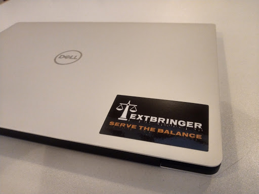
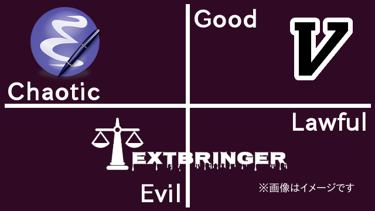

# TextbringerでつくるTextbringer

平成Ruby会議01  2019-12-14

前田 修吾

株式会社ネットワーク応用通信研究所

## この発表を聴いた人が何を持ち帰れるか

* Rubyの動的な性質を活かす方法とTextbringerステッカー

## Textbringerステッカー

## アンケート

主に使っているエディタは？

1. Emacs系 (JED/xyzzyなども含む)
2. vi系 (Vim/Neovimなども含む)
3. それ以外

## Textbringer

* テキストエディタ
* Rubyで書いたEmacs
* 端末で動く
* 今このプレゼンテーションでも使っている

## 名前の由来

## エルリックサーガ

* マイクルムアコックが書いた小説群
* エルリック
    * メルニボネの皇帝
    * アルビノ (白髪、白い肌、赤い目) にして病弱
    * 混沌の神アリオッチに仕える
* Stormbringer
    * 黒の剣
    * 魂を啜ってエルリックにその力を与える
    * 世界を滅ぼすほどの力をもつ
* Textbringerがもたらすのは嵐ではなくテキストなので安全

## 法と混沌、そして天秤

* 法 (Law)
    * 秩序・規律 → 停滞
* 混沌 (Chaos)
    * 多様性・変化 → 破壊
* 宇宙の天秤 (Cosmic Balance)
    * 法と混沌の釣り合い

## Cosmic Balance

## ブートストラップ問題

* テキストエディタを書くにはテキストエディタが必要
    1. VimでTextbringerを書く
    2. だいたい動くようになる
    3. TextbringerでTextbringerを書く
    4. Textbringerが壊れる
    5. 1に戻る

## 何もしてないのに壊れた

## Feature #13083

* Regexp#match(nil) and Regexp#match?(nil) now raise TypeError
* 現在はrevert

## END
